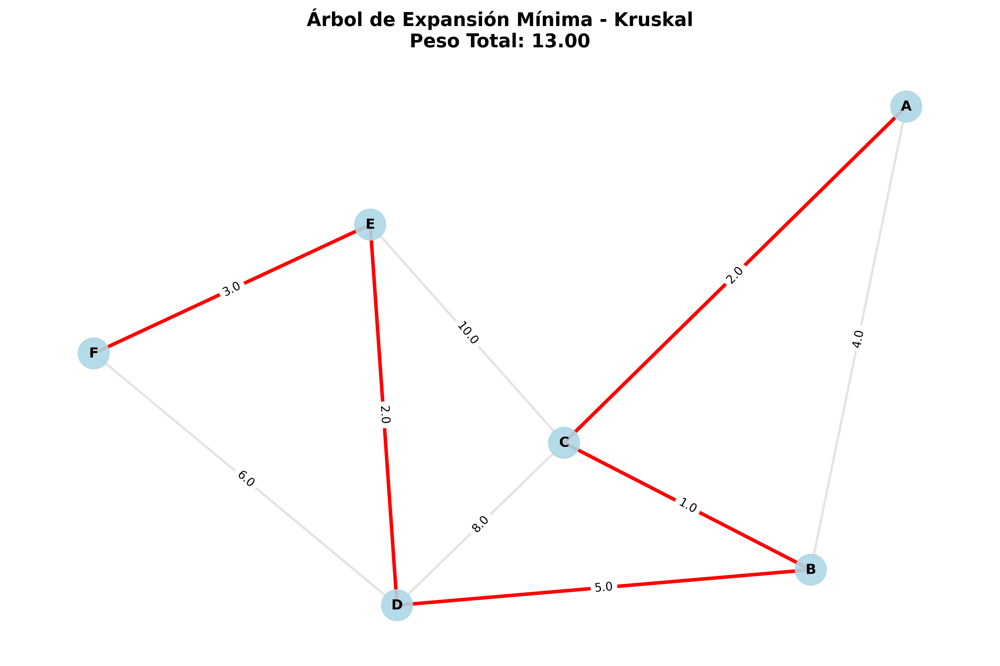
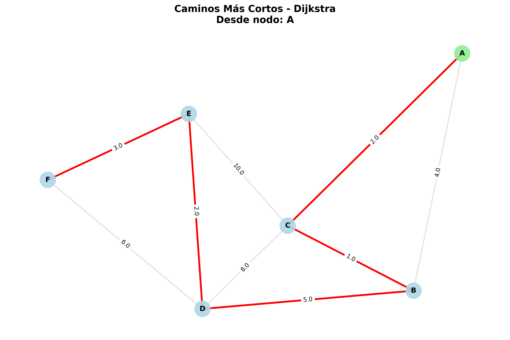
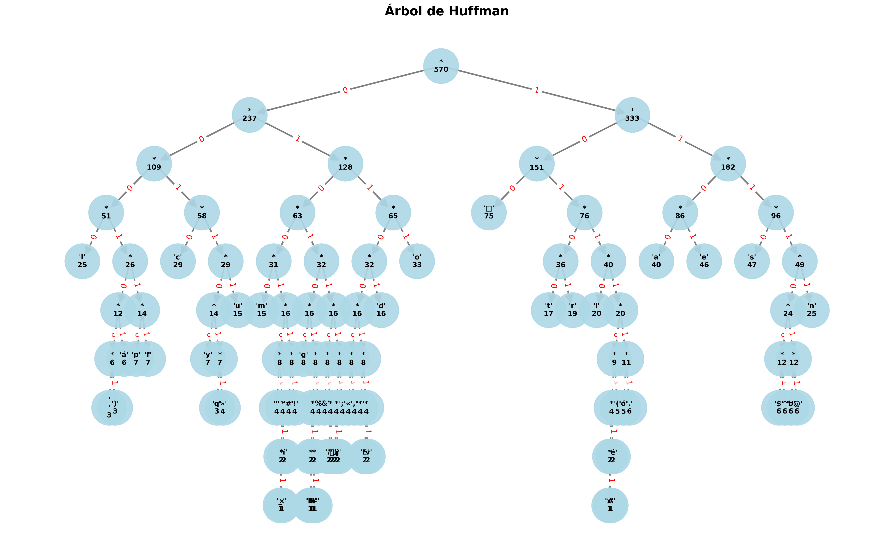
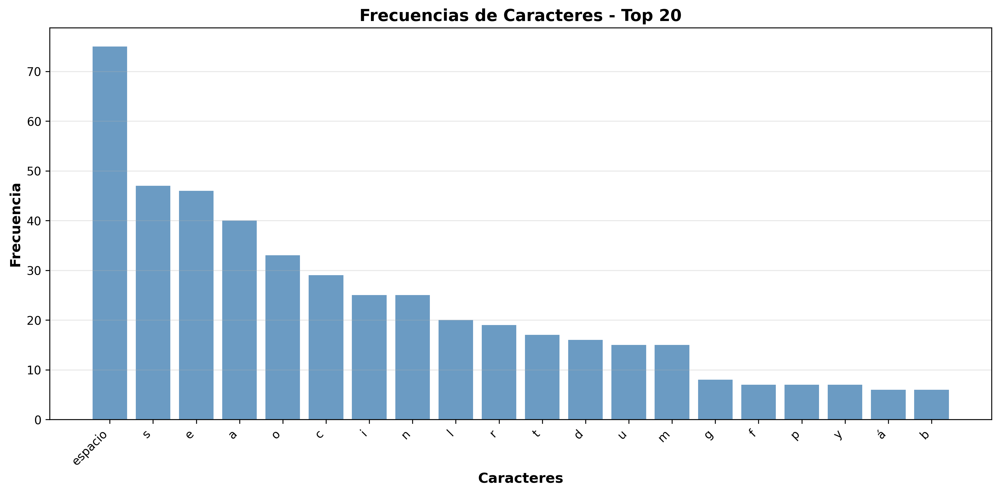
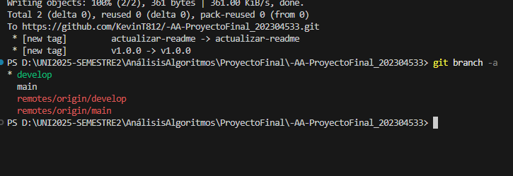
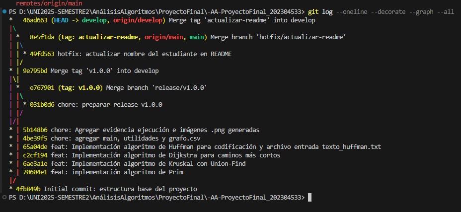
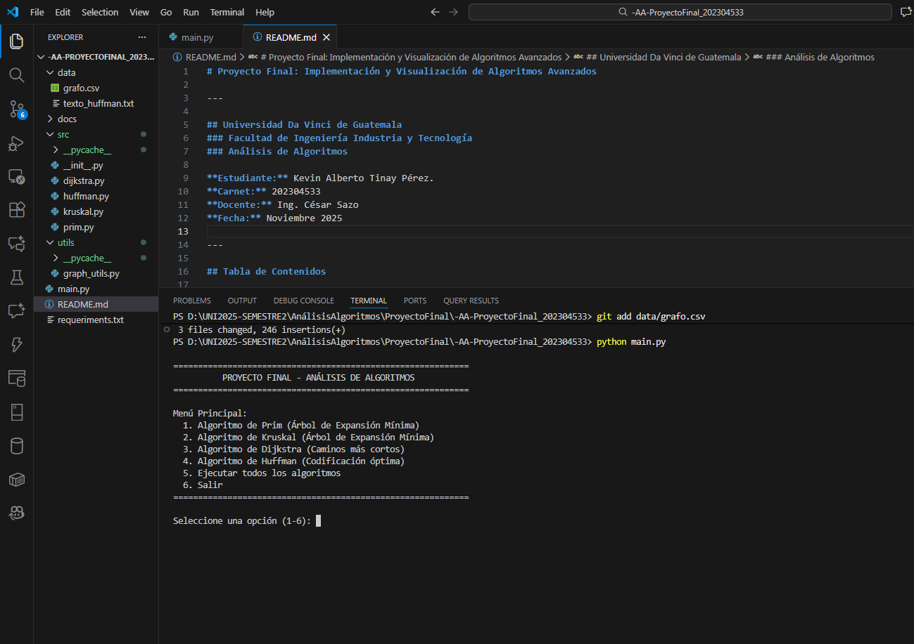

# Proyecto Final: Implementación y Visualización de Algoritmos Avanzados

---

## Universidad Da Vinci de Guatemala
### Facultad de Ingeniería Industria y Tecnología
### Análisis de Algoritmos

**Estudiante:** Kevin Alberto Tinay Pérez.  
**Carnet:** 202304533  
**Docente:** Ing. César Sazo  
**Fecha:** Noviembre 2025

---

## Tabla de Contenidos

1. [Objetivo General](#objetivo-general)
2. [Objetivos Específicos](#objetivos-específicos)
3. [Explicación Teórica de Algoritmos](#explicación-teórica-de-algoritmos)
4. [Complejidad Teórica](#complejidad-teórica)
5. [Formato de Entrada](#formato-de-entrada)
6. [Ejecución del Programa](#ejecución-del-programa)
7. [Resultados y Visualizaciones](#resultados-y-visualizaciones)
8. [Flujo Gitflow Aplicado](#flujo-gitflow-aplicado)
9. [Conclusiones](#conclusiones)

---

## Objetivo General

Desarrollar un proyecto integral que implemente, analice y visualice los algoritmos Prim, Kruskal, Dijkstra y Huffman, utilizando archivos externos para la entrada de datos, generando imágenes PNG como evidencia del procesamiento y aplicando un flujo profesional de trabajo basado en Gitflow.

---

## Objetivos Específicos

- Implementar de forma modular los algoritmos de Prim, Kruskal, Dijkstra y Huffman
- Leer grafos desde archivos CSV y textos desde archivos TXT
- Generar gráficos PNG como salida visual obligatoria
- Documentar el proyecto de manera profesional
- Aplicar Gitflow con ramas, PRs, merges, tags y organización adecuada
- Explicar la complejidad teórica de cada algoritmo

---

## Explicación Teórica de Algoritmos

### 1. Algoritmo de Prim

El algoritmo de Prim es un algoritmo greedy que encuentra el Árbol de Expansión Mínima (MST) de un grafo no dirigido y ponderado. Un MST es un subconjunto de aristas que conecta todos los vértices con el peso total mínimo posible, sin formar ciclos.

**Funcionamiento:**
1. Se inicia desde un vértice arbitrario
2. Se selecciona la arista de menor peso que conecta un vértice del árbol con uno fuera del árbol
3. Se agrega esta arista al MST
4. Se repite hasta incluir todos los vértices

**Características:**
- Utiliza una cola de prioridad (heap) para seleccionar eficientemente la siguiente arista
- Garantiza encontrar un MST óptimo
- Funciona solo con grafos conexos

### 2. Algoritmo de Kruskal

El algoritmo de Kruskal es otro algoritmo greedy para encontrar el MST, pero con un enfoque diferente al de Prim. Selecciona aristas en orden creciente de peso, evitando ciclos mediante la estructura Union-Find.

**Funcionamiento:**
1. Se ordenan todas las aristas por peso de menor a mayor
2. Se procesan las aristas en orden
3. Se agrega cada arista si no forma un ciclo con las aristas ya seleccionadas
4. Se continúa hasta tener V-1 aristas (donde V es el número de vértices)

**Características:**
- Utiliza la estructura de datos Union-Find (Disjoint Set) para detectar ciclos eficientemente
- No requiere un vértice de inicio específico
- Ideal para grafos dispersos (pocas aristas)

### 3. Algoritmo de Dijkstra

El algoritmo de Dijkstra encuentra los caminos más cortos desde un vértice origen hacia todos los demás vértices en un grafo con pesos no negativos.

**Funcionamiento:**
1. Se inicializan todas las distancias como infinito, excepto el origen (0)
2. Se selecciona el vértice no visitado con menor distancia
3. Se actualizan las distancias de sus vecinos si se encuentra un camino más corto
4. Se marca el vértice como visitado
5. Se repite hasta visitar todos los vértices

**Características:**
- Utiliza una cola de prioridad para seleccionar eficientemente el siguiente vértice
- Mantiene un registro de predecesores para reconstruir los caminos
- No funciona correctamente con pesos negativos

### 4. Algoritmo de Huffman

El algoritmo de Huffman es un método de compresión sin pérdida que genera códigos de longitud variable óptimos para cada carácter basándose en sus frecuencias.

**Funcionamiento:**
1. Se calculan las frecuencias de cada carácter en el texto
2. Se crea un bosque de árboles, uno por cada carácter
3. Se combinan repetidamente los dos árboles de menor frecuencia
4. El proceso continúa hasta tener un único árbol
5. Los códigos se asignan recorriendo el árbol: 0 para izquierda, 1 para derecha

**Características:**
- Asigna códigos más cortos a caracteres más frecuentes
- Genera códigos de prefijo (ningún código es prefijo de otro)
- Óptimo para compresión basada en frecuencias de símbolos individuales

---

## Complejidad Teórica

### Algoritmo de Prim
- **Complejidad temporal:** O(E log V)
  - E = número de aristas
  - V = número de vértices
  - Usando heap binario para la cola de prioridad
- **Complejidad espacial:** O(V)

### Algoritmo de Kruskal
- **Complejidad temporal:** O(E log E)
  - Dominado por el ordenamiento de aristas
  - Operaciones Union-Find son O(E × α(V)) ≈ O(E)
  - α es la inversa de la función de Ackermann (prácticamente constante)
- **Complejidad espacial:** O(V)

### Algoritmo de Dijkstra
- **Complejidad temporal:** O((V + E) log V)
  - Usando heap binario
  - Cada vértice se procesa una vez: O(V log V)
  - Cada arista se examina una vez: O(E log V)
- **Complejidad espacial:** O(V)

### Algoritmo de Huffman
- **Complejidad temporal:** O(n log n)
  - n = número de caracteres únicos
  - O(n) para contar frecuencias
  - O(n log n) para construir el árbol usando heap
- **Complejidad espacial:** O(n)

---

## Formato de Entrada

### Grafos (Prim, Kruskal, Dijkstra)

**Archivo CSV:** `data/grafo.csv`

Formato: `origen,destino,peso`

```csv
A,B,4
A,C,2
B,C,1
B,D,5
C,D,8
C,E,10
D,E,2
D,F,6
E,F,3
```

**Requisitos:**
- Sin encabezados
- Grafos no dirigidos y ponderados
- Pesos deben ser números (enteros o decimales)
- Separados por comas

### Texto (Huffman)

**Archivo TXT:** `data/texto_huffman.txt`

Puede contener cualquier texto con:
- Letras mayúsculas y minúsculas
- Espacios, puntos, comas
- Caracteres especiales
- Saltos de línea

---

## Ejecución del Programa

### Instalación de Dependencias

```bash
pip install -r requirements.txt
```

### Ejecución del Menú Principal

```bash
python main.py
```

### Menú Interactivo

```
==============================================================
          PROYECTO FINAL - ANÁLISIS DE ALGORITMOS
==============================================================

Menú Principal:
  1. Algoritmo de Prim (Árbol de Expansión Mínima)
  2. Algoritmo de Kruskal (Árbol de Expansión Mínima)
  3. Algoritmo de Dijkstra (Caminos más cortos)
  4. Algoritmo de Huffman (Codificación óptima)
  5. Ejecutar todos los algoritmos
  6. Salir
==============================================================

Seleccione una opción (1-6):
```

### Ejecución Individual

```bash
# Ejecutar solo Prim
python src/prim.py

# Ejecutar solo Kruskal
python src/kruskal.py

# Ejecutar solo Dijkstra
python src/dijkstra.py

# Ejecutar solo Huffman
python /huffman.py
```

---

## Resultados

### Prim - Árbol de Expansión Mínima


**Resultado:** El algoritmo encuentra el MST con peso total mínimo. Las aristas rojas muestran el árbol de expansión mínima.

### Kruskal - Árbol de Expansión Mínima



**Resultado:** El algoritmo encuentra el mismo MST que Prim (puede variar el orden de selección de aristas con igual peso).

### Dijkstra - Caminos Más Cortos



**Resultado:** Muestra los caminos más cortos desde el nodo origen (verde) hacia todos los demás nodos. Las aristas rojas representan el árbol de caminos más cortos.

### Huffman - Árbol de Codificación



**Resultado:** Árbol binario de Huffman donde cada hoja representa un carácter. Los caminos desde la raíz definen los códigos binarios.

### Huffman - Frecuencias de Caracteres



**Resultado:** Gráfico de barras mostrando las frecuencias de los caracteres más comunes en el texto.

---

## Flujo Gitflow Aplicado

### Ramas Creadas

- `main` - Rama principal de producción
- `develop` - Rama de desarrollo
- `feature/prim` - Implementación del algoritmo de Prim
- `feature/kruskal` - Implementación del algoritmo de Kruskal
- `feature/dijkstra` - Implementación del algoritmo de Dijkstra
- `feature/huffman` - Implementación del algoritmo de Huffman
- `hotfix/actualizar-readme` - Corrección de nombre en README
- `release/v1.0.0` - Preparación de la versión 1.0.0

### Proceso de Trabajo

1. **Desarrollo de Features:**
   - Cada algoritmo se desarrolló en su propia rama `feature/`
   - Se realizaron commits
   - Se crearon Pull Requests hacia `develop`
   - Se revisó y aprobó cada PR antes del merge

2. **Hotfix:**
   - Se creó rama `hotfix/actualizar-readme` desde `main`
   - Se corrigió el nombre del estudiante
   - Se hizo merge a `main` y `develop`

3. **Release:**
   - Se creó rama `release/v1.0.0` desde `develop`
   - Se realizaron pruebas finales
   - Se hizo merge a `main` con tag `v1.0.0`
   - Se hizo merge de vuelta a `develop`

### Evidencias

#### Git Branch



#### Git Log



#### Pull Requests


#### Ejecución del Programa



---

## Conclusiones

* Se implementaron correctamente los cuatro algoritmos solicitados (Prim, Kruskal, Dijkstra y Huffman) con sus respectivas visualizaciones en PNG.

* Se comprendió y documentó la complejidad teórica de cada algoritmo:
   - Prim: O(E log V)
   - Kruskal: O(E log E)
   - Dijkstra: O((V + E) log V)
   - Huffman: O(n log n)

* Las imágenes PNG generadas permiten visualizar claramente los resultados de cada algoritmo, facilitando la comprensión y verificación de la correctitud.

* Se aplicó exitosamente el flujo de trabajo Gitflow con ramas de features, hotfix, release y tags, demostrando buenas prácticas de versionamiento.

* Todo el código está documentado con docstrings siguiendo PEP-257, y el README proporciona información completa sobre el proyecto.

* Los algoritmos implementados tienen aplicaciones reales:
   - Prim/Kruskal: Diseño de redes de menor costo (telecomunicaciones, carreteras)
   - Dijkstra: Sistemas de navegación GPS, enrutamiento de redes
   - Huffman: Compresión de archivos (ZIP, JPEG, MP3)

* Este proyecto permitió comprender la importancia de las estructuras de datos y cómo impactan en la eficiencia de los algoritmos.

---
